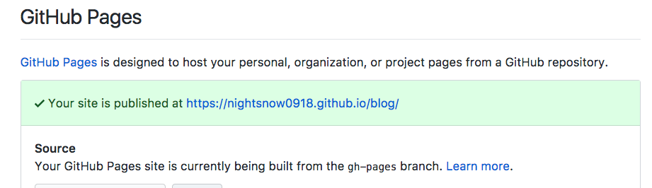

# Github pages + Jekyll theme 開站小記  

(最初這個網頁是用第三方的 Jekyll Theme 來假的，雖然目前這個站已經改用 Vuepress，但此篇還是保留當作參考)

## 開設流程

主要分為設定 Github Pages 和導入 Jekyll theme 兩個步驟。

### Github Pages 設定

最簡單的方法就是建立一個名為 `[USERNAME].github.io` 的 repo，`[USERNAME]` 就是你的 github 帳號名稱，然後在 `master` branch 放一個 `index.html`，就完成了。之後你可以連上 `https://[USERNAME].github.io`，就可以看到 `index.html` 裡面的內容了。

如果你不想用 `[USERNAME].github.io` 這種名稱來代表你的 blog repo，那就要用另一種方式。首先先建立一個空的 blog repo (假設名稱就叫做 'blog')，把它 clone 下來，接著用下列指令分支出一個名為 `gh-pages` 的 branch:

  ```cmd
  git clone [Your GitHub Repo URL]
  git checkout --orphan gh-pages
  ```

這裡的 `--orphan` 代表該分支是沒有母節點的，也就是它會獨立於 `master` 之外，將來也不能用 `git merge` 或 `git rebase` 的指令來和 `master` branch 合併。這是 github pages 的規則，若你要使用非 username 型式的 repo 來使用 github pages，就必須這麼做。將來的 commit 也必須都放到 `gh-pages` 這個分支上。

接著按照一般的方式將內容 commit 到分支上後，再 push 到 github 對應的 repo (blog)，就可以了。

  ```cmd
  git add .
  git commit -m 'My First Commit'
  git push origin gh-pages
  ```

想確認有沒有成功 publish 到 github page 可以到設定頁面查看，上面也會顯示你的網頁被發佈到哪個 URL，可以直接點擊這個 URL 來查看你的網頁。這邊你應該會注意到，和單純以 username 當作 repo 的方式不同的是，URL 後面會多出 `/blog`。

設定頁面查看方式:

- 在 blog repo 裡面選擇 'settings' 標籤，左方選擇 'Options'，往下拉到 'Github Pages' 的 section，如果成功的話會有一個淺籃色底的訊息顯示:
- 如果沒有成功也會顯示訊息，這時候就要到 [trouble shooting](https://help.github.com/articles/troubleshooting-github-pages-builds/) 頁面查查看可能的原因。

最後應該會出現以下畫面：



完成了! 你的網誌被架設在 `https://[USERNAME].github.io/blog/`，而 source code 則被保存在 `blog` repo 的 `gh-pages` branch。利用這種方式，如果你有多個 project，就可以分放在多個 repo 裡面；最終你的各 project URL 就會對應你的 repo 名稱，也就是 `https://[USERNAME].github.io/[REPO NAME]`。

### 使用 Jekyll Theme

[Jekyll](https://jekyllrb.com/) 是一個靜態網頁產生器，使用 ruby 實作出來的[^1]。Jekyll 本身含有類似於 jinja 或 django template 的 template engine[^2]，可以讓開發者自定 HTML template pattern，埋入 jekyll 內建或是使用者自定的參數及函式，再執行 jekyll，就可以產生出所有的靜態網頁，而不用一頁一頁自己刻出來 (汗)。

不過要用 Jekyll 還是得寫出自己的模版。對網頁外觀沒有特別的偏好，或是對 HTML/CSS 切板不熟或是沒 sense 的人，也可以套用線上已經建立好的 [Jekyll theme](http://themes.jekyllrc.org/)。這個網頁含有非常多由各方開發者開發出來的 jekyll theme，點擊 theme 縮圖可以看到它的預覽及安裝說明。

- 不過因為都是基於 Jekyll，基本上要做的不外乎設定 `Gemfile`, `_config.yml`，引入 `_include`, `_layout` 等等資料夾，不同的地方在於各 theme 的客製化功能使用方式，這就要去閱讀每個 theme 的說明文件了。

通常在依照文件設定好之後，可以在本機的同一個資料夾下 `jekyll serve`，會在本機的 4000 port 起一個暫時的 server，讓使用者可以觀看目前網頁的內容 (<http://127.0.0.1:4000>)。如果內容正確無誤，就可以部署到 Github pages 上了!

::: tip 關於本站的 jekyll theme...
這個網站本身則是使用 [mmistakes/minimal-mistakes](https://github.com/mmistakes/minimal-mistakes) 這個 jekyll theme，這裡面提到會用 `bundle` 這個套件來下 jekyll 指令，因為對 ruby 體系的套件不是很熟，所以我也只是照著做，這裡就不詳述了。
:::

::: tip Notes
當然也有其它語言寫成的產生器，像 Python 有 [pelican](https://blog.getpelican.com/)。不過 Jekyll 看來還是 github pages 搭配上的大宗，所以還是先試了這個。
:::
